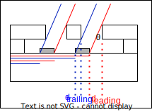

# Algorithm for PVD shadow simulation

The idea is that shadows are cast by the masking layers and cause metal to not appear in those areas. The key observation is that evaporated metal cannot go underneath the mask, but it can sneak underneath on the edges due to the under-cut. Thus, the chosen algorithm is brute-forced ray-casting. Consider the following diagram:

Note the following:

- The red lines are considered to be areas where metal can deposit, while blue areas are forbidden due to a shadow.
- The red areas are calculated from the distance of the full stack height: $d_{leading}=(d_{bottom}+d_{top})\tan(\theta)$
- The blue areas are calculated from the height of the bottom layer: $d_{trailing}=d_{bottom}\tan(\theta)$
- The areas where evaporated metal deposits have strictly more red lines than blue lines.

This logic is handled in 2D by ray-casting each line-segment into a 2D polygon (bound by the size of the chip). To handle the under-cut, an allowed-region mask is calculated by taking the gaps (in the mask) and expanding them by the prescribed under-cut distance. This allowed-region mask is taken with a logical AND on the calculated pattern.

To account for shadows from previously evaporated metallic layers, the algorithm just calculates the disallowed regions due to shadows cast by the metallic layers and then crops out those regions from the final calculated pattern. That is, the same algorithm need not be applied as there is no 'under-cut' for metal to sneak under previously evaporated metal.
