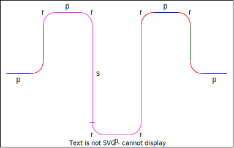

# Meander resonator derivation

The meander resonator family (e.g. `ResonatorMeander`) has 3 parameters that can generate the total length $\ell$ as shown in the following diagram:

For a given $N$ straight sections, the total width is: $w=s+2r$. The total length is:

$$
\ell={\color{blue}3p}+{\color{forestgreen}s-2r}+{\color{fuchsia}N(\pi r+p+s)}+{\color{red}2\pi r}
$$

while the horizontal length of the whole structure is:

$$
L={\color{blue}3p}+{\color{red}4r}+{\color{fuchsia}N(p+2r)}
$$

The idea is that one may constrain any two of:
- Absolute $L$
- Maximum $w$
- Absolute $r$

## Width and Radius constrained

If width is constrained, then $s_{max}=w-2r$. This means that the number of straight sections will be:

$$
N=\frac{\ell-3p-s_{max}-2\pi r+2r}{\pi r+p+s_{max}}
$$

To ensure that the width is not exceeded, take $\lceil N\rceil$ to ensure that the width will not exceed the constraint.

The flat section length is thus:

$$
s=\frac{\ell-3p-2\pi r+2r - \lceil N\rceil(\pi r+p)}{1+\lceil N\rceil}
$$

## Radius and horizontal length constrained

With the horizontal length $L$ fixed, the number of straight sections becomes:

$$
N=\frac{L-3p-4r}{p+2r}
$$

Thus, in this case, there will be some residual length $\ell_{resid}$ added to the ends (half on each side) to satisfy the constraint $L$:

$$
\ell_{resid}=L-(3p+4r+\lfloor N\rfloor(p+2r))
$$

The flat section length is thus:

$$
s=\frac{\ell-\ell_{resid}-3p-2\pi r+2r - \lfloor N\rfloor(\pi r+p)}{1+\lfloor N\rfloor}
$$

## Width and horizontal length constrained

In this case, one realises that the horizontal length constraint implies that for a given $N$, $r$ is constrained as:

$$
r=\frac{L-3p-Np}{4+2N}
$$

Then for this given $N$ and $r$, one may calculate $\ell_{resid}$ and subsequently $s$ to get the total width $s+2r$ (similar to the previous case). However, the idea here is to sweep and select $N$ with the largest total width less than the width constraint $w$. The swept values of $N$ vary from $1$ a simple maximum upper-bound estimate taken from the equation for $s$ (which must be positive; thus, positive in its numerator taking $r=0$):

$$
N_{max}=\left\lfloor\frac{L-3p}{p}\right\rfloor
$$

