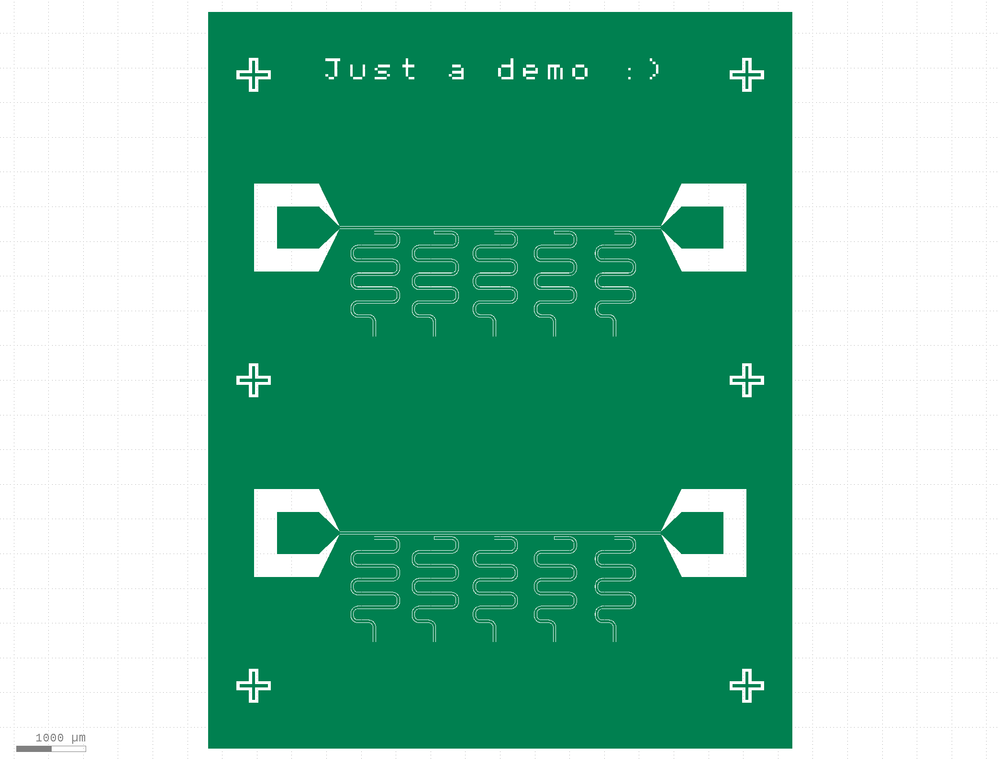

# Full chip maker

Modules found under `SQDMetal.Utilities.FullChipMaker` used for semi-automated generation of circuits commonly used for research of superconducting quantum circuits, taking inputs for important wafer-scale parameters (wafer size, die size, die layout), and all relevant circuit parameters (frequencies, materials, width dimension, etc.). 

This module relies on `SQDMetal` modules such as `SQDMetal.Utilities.QUtilities`, `SQDMetal.Utilities.MakeGDS`, `SQDMetal.Utilities.Material`, and functions for the calculation of resonator parameters located in `SQDMetal.Utilities.QubitDesigner`.

Currently, the supported circuits are:

- `MultiDieChip.make_resonator_chip()` - creates a `.gds` full-wafer layout file for a simple coplanar waveguide $\lambda/4$ resonator chip containing a number of resonators (usually 5) capacitively coupled to a transmission line


## Circuit types

The circuits listed within the section are called as functions within the `MultiDieChip` class.


### Hanger-mode $\lambda/4$ resonator chip

To import, use:
```python
from SQDMetal.Utilities.FullChipMaker import MultiDieChip
```

You can now generate a `.gds` file for the full multi-die chip with the function `make_resonator_chip` as follows:

```python
d = MultiDieChip.make_resonator_chip(export_filename="FullChipMakerDemo", export_path='gds_designs', cpw_width="25um",export_type="positive", text_label="Just a demo :)", chip_dimension=("8.4mm", "10.6mm"), text_size=400, text_position=(0.2, 0.9))
```

The above call mostly uses the default function values (which can be found in the source code), and user-input arguments. This produces the `.gds` shown below.



The full list of inputs are as follows:

Inputs:
- `export_filename` - Filename for gds export (e.g. "test")
- `export_path` - Path for export (e.g. 'exports'); the file will then be output to /exports/test.gds
- `export_type` - (Defaults to "all") Export type for lithography as per `MakeGDS` (options: "all", "positive", "negative")
- `frequency_range` - (Defaults to (6e9, 7e9)) Tuple containing minimum and maximum resonator frequencies in Hz
- `num_resonators` - (Defaults to 5) Number of resonators per die
- `cpw_width` - (Defaults to "9um") Width of the central trace on the feedline and resonators. The gap will be automatically calculated for 50 Ohm impedance based on the `substrate_material`
- `coupling_gap` - (Defaults to "20um") Amount of ground plane in the coupling gap between the feedline and the resonator
- `tl_y` - (Defaults to "0um") The die-relative y-value for the main straight of the feedline (NOTE: currently only "0um" is supported)
- `res_vertical` - (Defaults to "1500um") Vertical length of resonator meanders
- `lp_to_res` - (Defaults to "300um") Minimum distance between the launchpad taper and the coupling length of the left-most resonator
- `lp_inset` - (Defaults to "0um") Inset of the launchpads along the x-axis relative to the die boundaries
- `lp_dimension` - (Defaults to "600um") Width of the launchpads' conductive centre pad (the launchpad gap scales accordingly)
- `lp_taper` - (Defaults to "300um") Length of the taper from launchpad to feedline
- `substrate_material` - (Defaults to "silicon") Substrate material (currently only "silicon" and "sapphire" are supported)
- `substrate_thickness` - (Defaults to "0.5mm") Substrate thickness
- `film_thickness` - (Defaults to "100nm") Film thickness
- `chip_dimension` - (Defaults to ("20mm", "20mm")) Dimensions of the chip as an (x, y) Tuple
- `chip_border` - (Defaults to "500um") Chip border to leave un-patterned
- `die_dimension` - (Defaults to ("7.1mm", "4.4mm")) Dimensions of the die as an (x, y) Tuple
- `die_num` - (Defaults to [1, 1])) Die layout in [x, y] as a length-2 list
- `fill_chip` - (Defaults to True) Boolean to choose whether the full chip is automatically populated with dies (over-rides die_num if True)
- `markers_on` - (Defaults to True) Print dicing markers on export
- `text_label` - (Optional) Text label to print on chip
- `text_size` - (Defaults to 600) Text size
- `text_position` - (Optional) Tuple of text label location as normalised (x, y) (e.g. (0.1, 0.9) will place the text label 1/10th of the way along the chip in the x-direction, and 9/10ths of the way up the chip in the y-direction)
- `print_all_infos` - (Defaults to True) Choose whether to print info as the `.gds` is being generated


