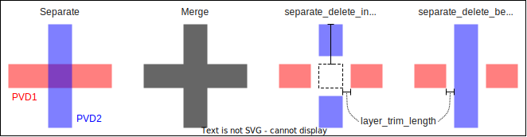

# Accounting for shadow evaporation

Shadow evaporation techniques in PVD (physical vapour deposition) are used to fabricate Josephson junctions. In angled evaporation, the substrate mask has an undercut. If the evaporation angle that is perpendicular to the substrate, the patterned metal will match the shape of the mask. However, if the evaporation is angled, then the top-layer mask will produce shadowed areas upon which no metal deposits. *SQDMetal* has a `PVD_Shadows` utility class to visualise the effect of the shadowed evaporation steps.

The geometry of shadow evaporation is illustrated below. The substrate has two layers of masks. Upon developing the top layer, there exists an undercut in the bottom layer where the mask has been cleared. When evaporating at an angle *θ*, the evaporated metal (in orange) is offset from the template defined by the top layer mask (that is, here it is offset to the right as opposed to being directly below the top layer). The extent of the evaporated metal is defined by the thickness of the two mask layers.


The `PVD_Shadows` class outputs the patterned metal in the presence of two-layer evaporations. Specifically, it can output the patterns over multiple angled evaporations defined not only by the angle *θ*, but also the azimuthal angle *ɸ*.

Note that the `PVD_Shadows` class currently assumes the following:

- There are two mask layers of which there is undercut on the bottom layer.
- The geometry within the *Qiskit-Metal* design object defines the openings in the top layer while the bottom layer has a uniform undercut following this template.
- The simulation does not account for the thickness of previously evaporated metallic layers.
- The simulation does not account for the reducing gap sizes in the top layer due to evaporations. For example, in the above example, the right wall of the top layer will have evaporated metal that will reduce the gap seen by evaporations that follow.

The last two points may get addressed in future releases.


## Defining PVD parameters in the *Qiskit-Metal* design object

Before using the `PVD_Shadows` class, the *Qiskit-Metal* design object must have evaporation options defined as follows:

```python
design.chips['main']['evaporations'] = Dict(
    layer2=Dict(
        bottom_layer='414nm',
        top_layer='500nm',
        undercut='200nm',
        pvd1 = Dict(
        angle_phi = '-90',
        angle_theta = '45',
        metal_thickness = '10nm'
        ),
        pvd2 = Dict(
        angle_phi = '0',
        angle_theta = '45',
        metal_thickness = '100nm'
        )
    )
)
```

Note the following:

- The options for a given chip (in this case `'main'`) are given in a `Dict` key `'evaporations'`.
- The chip geometries are divided into layers (via the `layer` option) where every layer is taken as a different lithography+PVD step. In the above example, the key `'layer2'` denotes an angled evaporation step used when patterning layer 2. If no options are given for a particular layer, it is assumed that the evaporation is done vertically at *θ*=0.
- The `Dict` object given for a particular layer must specify the mask layer thicknesses (via the keys `'top_layer'` and `'bottom_layer'`) and the `'undercut'` distance.
- PVD step may consist of multiple angled evaporations, each of which is given under the keys enumerating from 1 onwards (two evaporations in the above example `'pvd1'` and `'pvd2'`).
- The evaporation angles for angled evaporation is given by the azimuthal and polar angles *ɸ* and *θ* respectively.
- The `metal_thickness` is optional. If given, it will account for the metal's thickness in the subsequent evaporation step.

The angles constitute the spherical polar angle from which the evaporated ray arrives:


## Using the PVD_Shadows class

Once the PVD options have been defined for the layers using angled evaporation, the net result can be viewed via helper functions in the `PVD_Shadows` class.

```python
from SQDMetal.Utilities.PVD_Shadows import PVD_Shadows

#Instantiate a PVD_Shadows object for the Qiskit-Metal design object: design
pvdSh = PVD_Shadows(design)

#Plot Layer 2 showing each angled evaporation step separately and do not plot mask
pvdSh.plot_layer(2,'separate', plot_mask=False)

#Plot all layers showing each angled evaporation step separately, but show the mask
pvdSh.plot_all_layers('separate')
```

Note that when plotting all layers, the mask is the union of all layers' mask shapes.

Typically there is an oxidation step in between angled evaporation steps. Thus, when simulating multiple angled evaporations, the regions that overlap need to be separated. The `PVD_Shadows` class facilitates this via different options to help separate the metals from different angled evaporations.

```python
#Merge all angled evaporation steps in a given layer via a union:
pvdSh.plot_layer(2,'merge')

#Plot all angled evaporations separately in a given layer while deleting all intersections (along with a trimming boundary)
pvdSh.plot_layer(2,'separate_delete_intersections', layer_trim_length=20e-9)

#Plot all angled evaporations separately in a given layer while deleting all intersections in the first angled evaporations (along with a trimming boundary)
pvdSh.plot_layer(2,'separate_delete_below', layer_trim_length=20e-9)
```

Note that the function `plot_all_layers` accepts the same options outlined above. The option `layer_trim_length` is given in metres. The resulting patterns from the given options are shown below:




